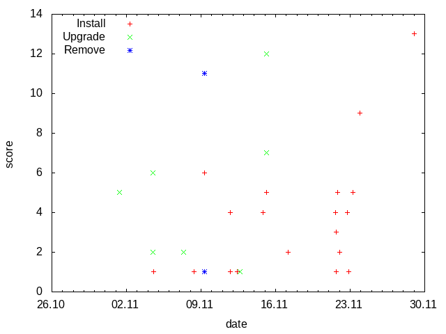

Examples
========

Create frequency graph from a log
---------------------------------

**Task:** Read /var/log/dpkg.log and create a graph to visualize how often packages are installed, upgraded and removed.

**Solution:** The loop (30) calls function *read_log* which reads the log line by line (13), splits the fields (14) and concatenate date *l[0]* and time *l[1]* in minutes (15). Third field of the log *l[2]* is status of the dpkg operation(install, upgrade, remove ...). Method *zincrby* (16) increments by 1 the score of *word* in the key *l[2]*. As a result the database contains keys(install, upgrade, remove ...) and associated lists of *words* sorted by score. Next loop (33) calls the function *write_csv* with all keys.  As a result csv files are created in the current directory with the *word;score* pairs.

.. `[source] <../../code/create-graph-01.py>`_

.. literalinclude:: code/create-graph-01.py
   :linenos:
   :emphasize-lines: 16, 22, 27, 33

**Result:** The csv files can be used to create a graph with *gnuplot*.

.. `[source] <../../source/code/create-graph-01.gnuplot>`_

List 10 most used words in a text
---------------------------------

**Task:** Read text from a file and list 10 most frequently used words in it.

**Solution:** Let's use article about Redis at wikipedia.org as a text.

.. `[source] <../../source/code/create-topchart-text.bash>`_

.. literalinclude:: code/create-topchart-text.bash

To tokenize words from the text we use `NLTK <http://www.nltk.org/>`_. `NLTK data <http://www.nltk.org/data.html>`_ must be installed by *nltk.download()* (8) before *word_tokenize* (18) and *wordnet.synsets* (21) can be used. Complete NLTK data is over 3GB, hence the download (8) is commented. *zincrby* (22) increments by 1 the score of *word* in the key *topchart* and *zrange* (24) returns top 10 words with scores.

.. `[source] <../../source/code/create-topchart.py>`_

.. literalinclude:: code/create-topchart.py
   :linenos:
   :emphasize-lines: 12, 22, 24

**Result:**

.. code-block:: bash

   > ./create-topchart.py
   is,24
   a,23
   in,19
   edit,13
   Retrieved,11
   by,10
   database,9
   Labs,9
   are,8
   on,7
   data,7

